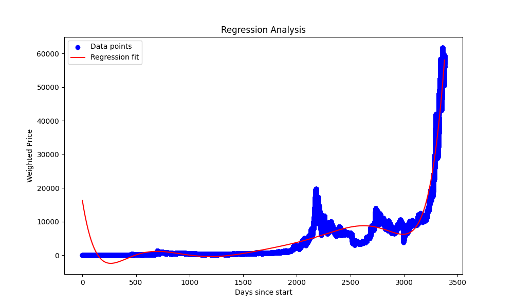
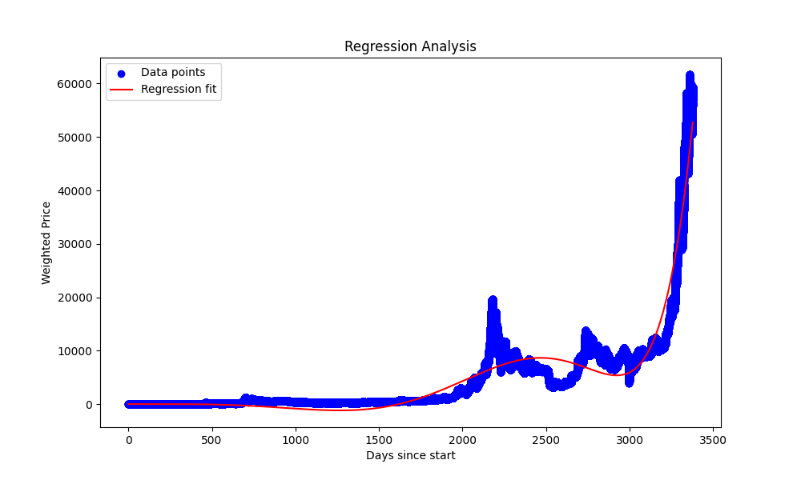

# Regression Analysis on Financial Data

This project performs regression analysis on a given dataset using both linear and polynomial regression methods. The methods implemented include closed-form solutions and gradient descent.

## Table of Contents

- [Introduction](#introduction)
- [Requirements](#requirements)
- [Usage](#usage)
- [Results](#results)
- [File Description](#file-description)
- [Notes](#notes)
- [Contributing](#contributing)
- [License](#license)

## Introduction

This project provides a way to perform regression analysis on a dataset, specifically focusing on financial data. It supports both linear and polynomial regression, and can handle these using both closed-form solutions and gradient descent methods.

The process includes:
- Data loading and preprocessing
- Applying regression models (linear and polynomial)
- Generating visualizations of the regression results

## Requirements

- Python 3.x
- NumPy (numpy)
- Pandas (pandas)
- Matplotlib (matplotlib)
- scikit-learn (sklearn)

You can install the required packages using the following command:
```bash
pip install numpy pandas matplotlib scikit-learn
```

## Usage

To run the script, use the following command:
```bash
python miw_s22326_task03.py <input_file> <algorithm_type> <polynomial_degree>
```

- `<input_file>`: Path to the CSV file containing the dataset.
- `<algorithm_type>`: Type of regression algorithm to use ('closed' or 'gradient').
- `<polynomial_degree>`: Degree of the polynomial to use.

## Results

### Regression Plots

#### Linear Regression (Closed Form)
The regression line fit using the closed form solution for linear regression.



#### Polynomial Regression (Gradient Descent)
The regression curve fit using gradient descent for polynomial regression.



## File Description

### `miw_s22326_task03.py`
This script contains the main logic for reading the dataset, performing regression analysis, and generating visualizations.

- `read_and_preprocess(file_path)`: Reads and preprocesses the dataset.
- `closed_form_solution(features, targets)`: Solves linear regression using the closed form solution.
- `polynomial_closed_form(features, targets, degree)`: Solves polynomial regression using the closed form solution.
- `plot_regression(X, y, model, degree, file_name)`: Plots the regression results and saves the plot.

## Notes

- This implementation includes handling for both linear and polynomial regression.
- It supports both closed-form solutions and gradient descent methods.
- Future improvements could include additional regression methods and more sophisticated data preprocessing.

## Contributing

Contributions are welcome! Please fork the repository and create a pull request with your changes.

## License

This project is licensed under the MIT License. See the [LICENSE](LICENSE) file for details.
